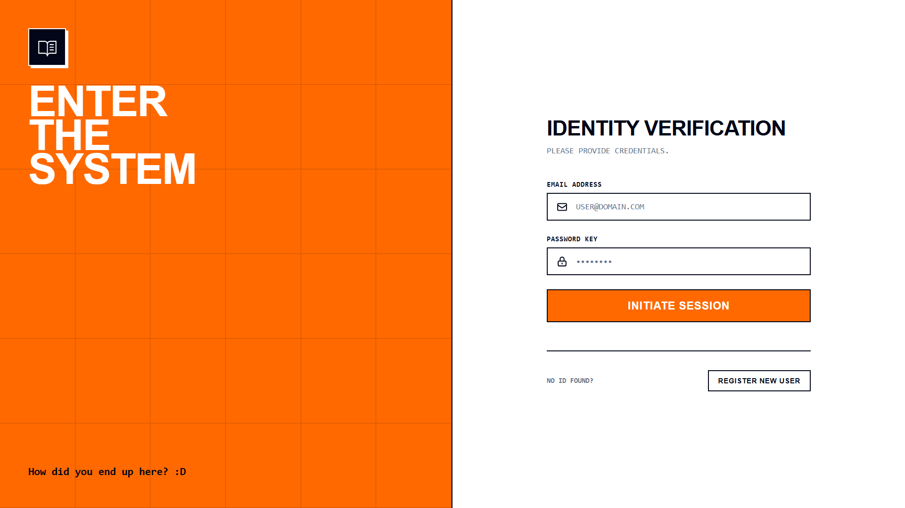
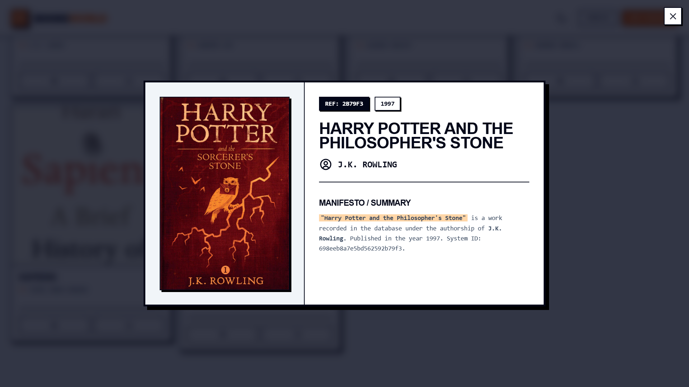
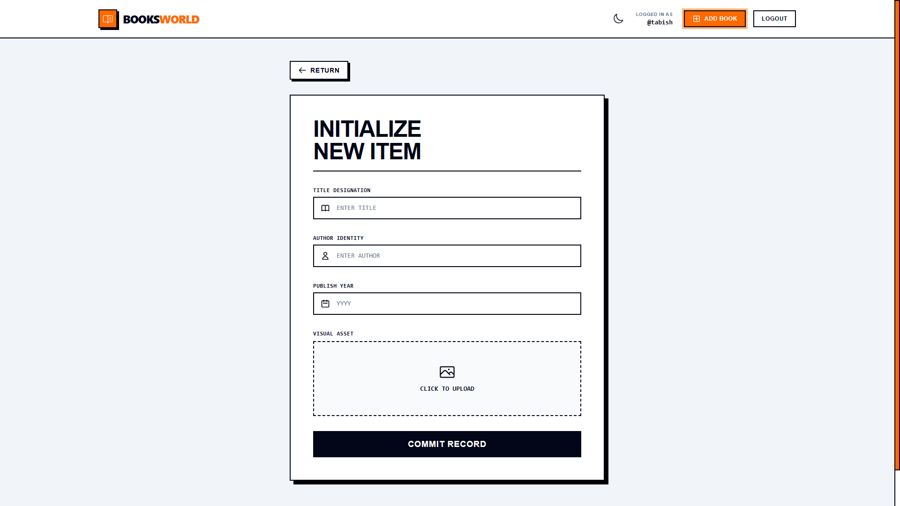
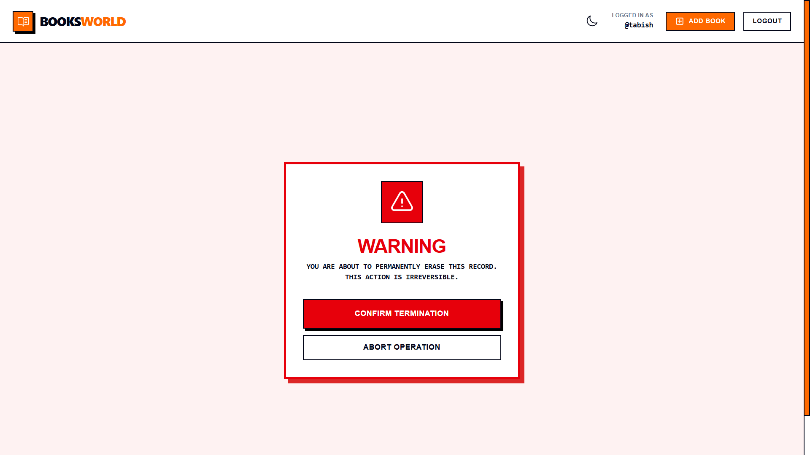

# 🧱 BOOK STORE

> **"RAW DATA MANAGEMENT SYSTEM v2.0"**
> A MERN Stack application featuring a strict Neo-Brutalist UI, JWT Authentication, and Full CRUD capabilities.


*(Place a screenshot of your Home page here)*

## ⚡ Features

### 🎨 Neo-Brutalist Design
- **Typography:** `Space Grotesk` (Headings) + `Space Mono` (Data).
- **Styling:** Strict 2px borders, **zero** border-radius, hard shadows.
- **Palette:** High-contrast Monochrome + International Orange.
- **Responsiveness:** Mobile-first stack layouts vs Desktop grids.

### 🔐 Security
- **JWT Authentication:** Secure Access Tokens (HttpOnly).
- **Password Hashing:** Bcrypt.
- **Protected Routes:** Private library management.

### 🛠 Tech Stack
- **Frontend:** React + Vite + Tailwind CSS (Custom Config).
- **Backend:** Node.js + Express.
- **Database:** MongoDB Atlas.
- **State:** React Context API + Axios.
- **Animations:** Framer Motion.

---

## 📸 Screenshots
(Add your screenshots to a `screenshots` folder in this repo!)

| Login Screen | Book Details |
| :---: | :---: |
|  |  |

| Create Book | Delete Warning |
| :---: | :---: |
|  |  |

---

## 🚀 Installation (Local)

1.  **Clone the repository:**
    ```bash
    git clone https://github.com/your-username/book-store.git
    cd book-store
    ```

2.  **Setup Backend:**
    ```bash
    cd backend
    npm install
    # Create .env file with:
    # PORT=5555
    # MONGODBURL=your_mongodb_connection_string
    # JWT_SECRET=your_jwt_secret
    npm run dev
    ```

3.  **Setup Frontend:**
    ```bash
    cd ../frontend
    npm install
    # Create .env file with:
    # VITE_API_URL=http://localhost:5555
    npm run dev
    ```

4.  **Access:** Open `http://localhost:5173`.

---

## 🌍 Deployment

This project is configured for free deployment on **Vercel** (Frontend & Backend).
See [DEPLOY.md](./DEPLOY.md) for step-by-step instructions.

---

## 📂 Project Structure

```
/
├── backend/            # Express Server
│   ├── models/         # Mongoose Schemas
│   ├── routes/         # API Routes
│   ├── middleware/     # Auth & Error Handling
│   └── index.js        # Entry Point (Vercel Ready)
│
└── frontend/           # React + Vite
    ├── src/
    │   ├── components/ # Brutalist UI Primitives
    │   ├── pages/      # View Logic
    │   ├── context/    # Auth State
    │   └── config.js   # Dynamic API Config
    └── tailwind.config # Design System
```

---

## 📝 License
This project is open source. "Public Domain Knowledge Base".
